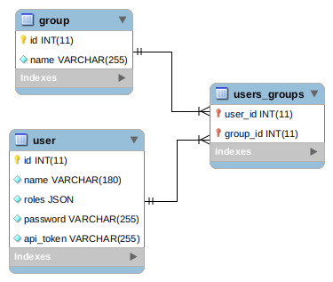

# Backend
Small API project using Symfony 4 with annotation and the Symfony security package configuration with
Token authentication, to not allow access to some routes.

This project is developed using PHP 7.2.19, Apache2 and MySql.
All entities of the project are mapped using Doctrine ORM.

## Implementation
Access permissions to routes are controlled by Symfony security package configuration in **config/package/security.yml* *
file and thought the custom implementation of the class **App\Security\TokenAuthentication** that extends Symfony mechanism
provided by **App\Security\AbstractGuardAuthenticator**.

All routes under /api are accessible only by "ROLE_ADMIN" and must provide a valid admin token, name and password inside
the header of the request. 

For testing, is possible to load fixtures and set in the header these params:
```
X-AUTH-TOKEN' => '7ac66c0f148de9519b8bd264312c4d64',
name' => 'NameAdmin',
password' => 'password',
'CONTENT_TYPE' => 'application/json
```
### Class diagram


### EER



### Routes
- **GET /api/user** to get all users
- **POST /api/user** to add  new user using in the body a json like 
```
    {
     "name": "my name",
     "password": "1233445",
      "roles": [
       "ROLE_ADMIN"
               ]
      }
```
- **DELETE /api/user/{id}** to delete the user with id
- **POST /api/user/setGroups** to assign groups to an user via a json in the body:
```
 {
   "userId": 1,
   "groupIds": [1,2]
 }
```
- **GET /api/group** to list all groups
- **POST /api/group** using in the body:
```
 {
    "name": "my group name"
 }
```
- **DELETE /api/group/{id}** to delete the group with id
- **POST /api/group/addUsers** to add users to a group with json:
```
 {
    "groupId": 1,
    "userIds": [1,2,3]
 }
```
- **POST /api/group/removeUsers** to remove users from a group with json:
```
 {
    "groupId": 1,
    "userIds": [1,2,3]
 }
```
## Set it up
- run `composer install`
- set database configuration in *.env* file 
- create test database `php bin/console doctrine:database:create`
- execute migrations: `php bin/console doctrine:migration:migrate`
- load fixtures: `php bin/console doctrine:fixtures:load` containing two users, with valid tokens

## Tests
- set test database configuration in *.env.test* file 
- create test database `php bin/console doctrine:database:create --env=test`
- execute migrations: `php bin/console doctrine:migration:migrate --env=test`
- load fixtures: `php bin/console doctrine:fixtures:load --env=test`
- run `./bin/phpunit`